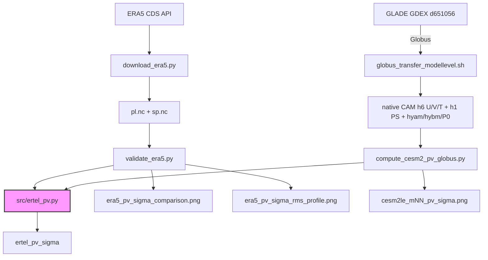

# pv_ertel_compute — Ertel PV on Sigma Levels with Spherical-Harmonic Gradients

Compute Ertel Potential Vorticity on terrain-following sigma levels ($\sigma = p/p_s$)
from gridded pressure-level atmospheric data (u, v, T, p_s). Uses spectrally accurate
spherical-harmonic horizontal derivatives and MPAS-style vertical differencing.

**Primary product**: sigma-coordinate PV on 11 essential levels (sfc → lower stratosphere).
Isobaric PV available as a backward-compatible reference.

## Formula

$$\text{PV}_\sigma = -\frac{g}{p_s}\left[ \frac{\partial v}{\partial\sigma}\frac{\partial\theta}{\partial x} - \frac{\partial u}{\partial\sigma}\frac{\partial\theta}{\partial y} + (f + \zeta)\frac{\partial\theta}{\partial\sigma} \right] \times 10^6 \ \text{PVU}$$

where $\sigma = p/p_s(x,y)$, $\theta = T(p_0/p)^{R_d/c_p}$ ($p_0 = 1000$ hPa constant),
$\zeta$ from spherical-harmonic vorticity, $f = 2\Omega\sin\phi$.

- **Horizontal derivatives**: `pvtend.sh_ops.gradient_sh` / `vortdiv_sh` — spectral accuracy, no polar singularity
- **Vertical derivatives**: MPAS-style centred interior, one-sided boundaries — coordinate order auto-detected
- **Sigma grid**: 11 essential levels {1.0, 0.925, 0.85, 0.7, 0.6, 0.5, 0.4, 0.3, 0.25, 0.2, 0.1}

## Variables Needed

| Variable | ERA5 | CESM2-LENS2 | Units |
|----------|------|-------------|-------|
| Eastward wind | `u` | `U` | m s⁻¹ |
| Northward wind | `v` | `V` | m s⁻¹ |
| Temperature | `t` | `T` | K |
| Surface pressure | `sp` | `PS` | Pa |
| Vertical coord | pressure levels | `lev` + `hyam`,`hybm`,`P0` | hPa / — |
| Latitude | `latitude` | `lat` | °N |
| Longitude | `longitude` | `lon` | °E |

> **ERA5** is on true isobaric levels — `lev` *is* the pressure. **CESM2 (CAM)** is on
> hybrid sigma-pressure model levels: `lev` is only a *nominal* reference pressure
> `(hyam+hybm)·P0`. The **true** pressure of each level is
> `p = hyam·P0 + hybm·PS(x,y)` (P0 = 100000 Pa; `hyam` is dimensionless). Pass
> `hyam`/`hybm` to `ertel_pv_sigma(...)` so the σ interpolation uses the true,
> terrain-following pressure — critical over high terrain. The AWS LENS2 zarr drops
> these coefficients, so the native CAM history files (GDEX d651056, via Globus) are
> used instead — see `cesm2_compute/globus_transfer_modellevel.sh`.

## Project Structure

```
pv_ertel_compute/
├── src/
│   ├── __init__.py
│   └── ertel_pv.py              # Core PV: ertel_pv_sigma() + ertel_pv_isobaric()
├── era_sanity_check/
│   ├── data/                     # Downloaded ERA5 NetCDF (u,v,t,pv,sp)
│   ├── plots/                    # Sigma validation plots
│   ├── download_era5.py          # CDS API download script
│   └── validate_era5.py          # Sigma PV vs ERA5 native PV
├── cesm2_compute/
│   ├── globus_transfer_modellevel.sh  # Globus: native CAM h6 U/V/T + h1 PS (GDEX d651056)
│   ├── compute_cesm2_pv_globus.py     # hybrid-correct PV from native model levels
│   └── globus_out/                    # PV netCDF + validation plot
├── handbook/
│   ├── ertel_pv_handbook.tex     # LaTeX math documentation
│   └── ertel_pv_handbook.pdf     # Compiled PDF
├── README.md
├── CHANGELOG.md                  # → /home/x_yan/.github/session_findings/changelogs/
└── plan.md
```

## Workflow



## Usage

### ERA5 Validation

```bash
cd era_sanity_check
micromamba run -n blocking python validate_era5.py
```

### CESM2-LENS2 PV (native hybrid model levels, via Globus)

See [`docs/cesm_hybrid_levels.md`](docs/cesm_hybrid_levels.md) for the full hybrid-level
+ Globus/GLADE reference (also the Claude skill `cesm-hybrid-levels`).

```bash
cd cesm2_compute
# (a) transfer native model-level data for a member/decade (huge, ~60 GB):
module load apps/globusconnectpersonal/3.2.2 && globus login   # once per session
bash globus_transfer_modellevel.sh 1 20102014                  # -> globus_data/m1_d20102014/

# (b) compute hybrid-correct sigma PV (kept day-slice sample works the same):
micromamba run -n blocking python compute_cesm2_pv_globus.py \
    --stage-dir globus_data/sample_m01_2010-01-01 --member 1 --date 2010-01-01
# add --cleanup to delete the raw decade files after extracting the day.
```

A 33 MB day-slice sample (U/V/T/PS + `hyam/hybm/P0` for 2010-01-01) is kept at
`cesm2_compute/globus_data/sample_m01_2010-01-01/`; the full ~60 GB decade files are
not retained.

### Python API

```python
from src.ertel_pv import ertel_pv_sigma, DEFAULT_SIGMA_LEVELS

# sigma PV on 11 levels (primary)
pv_sigma, p_3d = ertel_pv_sigma(u, v, t, plev_Pa, ps, lat, lon)
# pv_sigma: (11, nlat, nlon) in PVU
# p_3d:     actual pressure at each σ level

# Custom sigma levels
pv, p3d = ertel_pv_sigma(u, v, t, plev_Pa, ps, lat, lon,
                         sigma_levels=[1.0, 0.85, 0.7, 0.5, 0.3, 0.1])

# Isobaric PV (backward-compatible reference)
from src.ertel_pv import ertel_pv_isobaric
pv_iso = ertel_pv_isobaric(u, v, t, plev_Pa, lat, lon)
```

## Validation (ERA5, 2025-01-08 00Z, 11 σ levels)

| σ | Nom hPa | RMSE | Corr |
|---|---------|------|------|
| 0.850 | 861 | 0.30 PVU | 0.92 |
| 0.500 | 507 | 0.37 PVU | 0.94 |
| 0.250 | 253 | 1.12 PVU | 0.97 |

- **Sigma coordinates fix the near-surface problem**: 850 hPa-level correlation improved from 0.28 (isobaric) to 0.92 (sigma)
- **PV range matches ERA5**: [-51, 71] PVU (sigma) vs [-62, 111] PVU (ERA5 native)
- **0% NaN** in computed sigma PV
- **Stratospheric blow-up eliminated** by capping σ ≥ 0.1 (~100 hPa)

## Environment

| Env | Purpose |
|-----|---------|
| `blocking` | PV computation (pyspharm, windspharm, pvtend, xarray, s3fs) |

```bash
micromamba run -n blocking python <script>.py
```

## Key Design Decisions

- **P0 = 1000 hPa** is the thermodynamic reference for $\theta$ (standard definition, constant). **ps(x,y)** is surface pressure used ONLY for $\sigma = p/p_s$ and divisor $1/p_s$ — two distinct quantities.
- **11 sigma levels** span boundary layer → lower stratosphere. Above ~100 hPa ($\sigma < 0.1$), $\partial\theta/\partial\sigma$ explodes, producing unrealistic PV extremes — excluded by design.
- **Spherical harmonics** replace `np.gradient` — no polar clipping, global spectral accuracy.
- **Dry only** — no moisture/virtual-temperature correction (negligible effect, <0.001 PVU at 500 hPa).
- **Sigma-native computation** follows MPAS best-practice: PV on native model (terrain-following) levels, not isobaric. NCL and MetPy have known issues with sharp vertical PV gradients (AlexLojko, [MPAS forum 2024](https://forum.mmm.ucar.edu/threads/potential-vorticity-calculation-in-mpas-a.16001/)).
| `mpas_toolchain` | PV computation, CESM2 AWS access | xarray, numpy, scipy, s3fs, zarr, matplotlib, cartopy |
| `fourcastnetv2` | ERA5 CDS API download | cdsapi |

## Key Design Decisions

1. **Full 3-term formula** mirrors MPAS's complete dot product $\vec{\omega}_a \cdot \nabla\theta / \rho$
2. **Dry potential temperature** — no moisture correction (matches ERA5/CESM2 pressure-level convention)
3. **Finite differences** (not spectral) — mirrors MPAS discretization philosophy
4. **Centered vertical differences** with one-sided boundaries — exact MPAS analogue
5. **Pole-safe** horizontal derivatives — `cos(lat)` clipped to prevent singularity

## References

- MPAS Fortran: `mpas_toolchain/mpas/src/core_atmosphere/diagnostics/mpas_pv_diagnostics.F`
- Holton & Hakim (2013), *An Introduction to Dynamic Meteorology*, 5th ed.
- CESM2-LENS2 on AWS: https://registry.opendata.aws/ncar-cesm2-lens/
