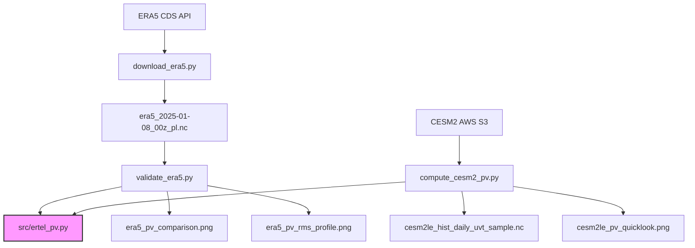

# pv_ertel_compute — MPAS-like Ertel PV on Pressure-Level Data

Compute Ertel Potential Vorticity from gridded pressure-level atmospheric data
(u, v, T), using the full 3-term isobaric formula with finite-difference
discretization that mirrors MPAS-Atmosphere's `mpas_pv_diagnostics.F`.

## Formula

$$\text{PV} = -g \left[ \frac{\partial v}{\partial p}\frac{\partial\theta}{\partial x} - \frac{\partial u}{\partial p}\frac{\partial\theta}{\partial y} + (f + \zeta)\frac{\partial\theta}{\partial p} \right] \times 10^6 \ \text{PVU}$$

where $\zeta = \partial v/\partial x - \partial u/\partial y$, $f = 2\Omega\sin\phi$,
and $\theta = T(p_0/p)^{R_d/c_p}$.

* Vertical derivatives: centred interior, one-sided at top/bottom boundaries (mirrors MPAS)
* Horizontal derivatives: `np.gradient` on regular lat-lon grid with Earth-radius scaling
* Pole handling: `cos(lat)` clipped to prevent division by zero

## Variables Needed

| Variable | ERA5 | CESM2-LENS2 | Units |
|----------|------|-------------|-------|
| Eastward wind | `u` | `U` | m s⁻¹ |
| Northward wind | `v` | `V` | m s⁻¹ |
| Temperature | `t` | `T` | K |
| Pressure levels | (coordinate) | `lev` | Pa |
| Latitude | `latitude` | `lat` | °N |
| Longitude | `longitude` | `lon` | °E |

**Vertical levels**: 32–37 pressure levels (surface → ~3 hPa) are sufficient.
The computation is performed on the data's native pressure levels — no vertical
interpolation is required.

## Project Structure

```
pv_ertel_compute/
├── src/
│   ├── __init__.py
│   └── ertel_pv.py          # Core PV computation module
├── era_sanity_check/
│   ├── data/                 # Downloaded ERA5 NetCDF
│   ├── plots/                # Validation comparison plots
│   ├── download_era5.py      # CDS API download script
│   └── validate_era5.py      # Validation against ERA5 native PV
├── cesm2_compute/
│   ├── data/                 # Downloaded CESM2 NetCDF sample
│   ├── plots/                # CESM2 PV quick-look plots
│   └── compute_cesm2_pv.py   # AWS S3 download + PV computation
├── README.md                 # This file
├── CHANGELOG.md              # Project history (symlinked)
└── plan.md                   # Initial project plan
```

## Workflow



## Usage

### ERA5 Validation

```bash
# Download ERA5 data (requires CDS API key in ~/.cdsapirc)
cd era_sanity_check
micromamba run -n fourcastnetv2 python download_era5.py

# Validate computed PV against ERA5 native PV
micromamba run -n mpas_toolchain python validate_era5.py
```

### CESM2-LENS2 PV Computation

```bash
# Download from AWS S3 and compute PV
cd cesm2_compute
micromamba run -n mpas_toolchain python compute_cesm2_pv.py
```

### Python API

```python
from src.ertel_pv import ertel_pv_isobaric

pv = ertel_pv_isobaric(u, v, t, plev_Pa, lat, lon, method="full")
# pv in PVU (10⁻⁶ K m² kg⁻¹ s⁻¹), shape (nlev, nlat, nlon)
```

## Validation Results (ERA5, 2025-01-08 00Z)

| Level | RMSE (full) | RMSE (simple) | Correlation |
|-------|-------------|---------------|-------------|
| 850 hPa | 3.54 PVU | 3.53 PVU | 0.27 |
| 500 hPa | 0.35 PVU | 0.21 PVU | 0.93–0.96 |
| 250 hPa | 1.14 PVU | 1.09 PVU | 0.96–0.97 |

- **500 hPa**: Excellent agreement — RMSE ~0.2–0.35 PVU, correlation >0.93
- **250 hPa**: Good agreement — RMSE ~1.1 PVU, correlation >0.96
- **850 hPa**: Poor agreement (expected — pressure vs terrain-following coordinate mismatch near surface)
- The **simple formula** (only $(f+\zeta)\partial\theta/\partial p$) matches ERA5 native PV better because ERA5 PV on pressure levels uses the same simplification.
- The **full formula** adds shear terms $(\partial v/\partial p)(\partial\theta/\partial x) - (\partial u/\partial p)(\partial\theta/\partial y)$ which contribute minimally at synoptic scales but add numerical noise.

## Environments

| Environment | Purpose | Key packages |
|-------------|---------|-------------|
| `mpas_toolchain` | PV computation, CESM2 AWS access | xarray, numpy, scipy, s3fs, zarr, matplotlib, cartopy |
| `fourcastnetv2` | ERA5 CDS API download | cdsapi |

## Key Design Decisions

1. **Full 3-term formula** mirrors MPAS's complete dot product $\vec{\omega}_a \cdot \nabla\theta / \rho$
2. **Dry potential temperature** — no moisture correction (matches ERA5/CESM2 pressure-level convention)
3. **Finite differences** (not spectral) — mirrors MPAS discretization philosophy
4. **Centered vertical differences** with one-sided boundaries — exact MPAS analogue
5. **Pole-safe** horizontal derivatives — `cos(lat)` clipped to prevent singularity

## References

- MPAS Fortran: `mpas_toolchain/mpas/src/core_atmosphere/diagnostics/mpas_pv_diagnostics.F`
- Holton & Hakim (2013), *An Introduction to Dynamic Meteorology*, 5th ed.
- CESM2-LENS2 on AWS: https://registry.opendata.aws/ncar-cesm2-lens/
