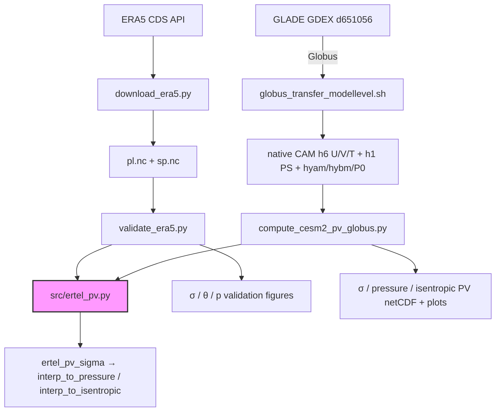

# pv_ertel_compute — Ertel PV on Sigma / Pressure / Isentropic Levels

Compute Ertel Potential Vorticity on terrain-following sigma levels ($\sigma = p/p_s$) from
gridded atmospheric data (u, v, T, p_s), using spectrally accurate **spherical-harmonic**
horizontal derivatives and MPAS-style vertical differencing. The σ-level PV can then be output on
**isobaric (pressure)** or **isentropic (θ)** surfaces.

**Primary product**: sigma-coordinate PV on 11 essential levels (sfc → lower stratosphere).
**Derived outputs**: PV interpolated to pressure levels, and PV sampled onto isentropic θ surfaces
(default {300, 315, 320, 330, 350} K — the mid-latitude isentropes used for RWB / blocking).

## Formula

$$\text{PV}_\sigma = -\frac{g}{p_s}\left[ (f + \zeta)\frac{\partial\theta}{\partial\sigma} + \frac{\partial v}{\partial\sigma}\frac{\partial\theta}{\partial x} - \frac{\partial u}{\partial\sigma}\frac{\partial\theta}{\partial y} \right] \times 10^6 \ \text{PVU}$$

where $\sigma = p/p_s(x,y)$, $\theta = T(p_0/p)^{R_d/c_p}$ ($p_0 = 1000$ hPa constant),
$\zeta$ is the spherical-harmonic relative vorticity, and $f = 2\Omega\sin\phi$. The full **3-term**
formula (`method="full"`) is the default for all products; `method="simple"` keeps only the
stretching term $(f+\zeta)\partial\theta/\partial\sigma$.

- **Horizontal derivatives**: `pvtend.sh_ops.gradient_sh` / `vortdiv_sh` (pyspharm spectral transforms) — global spectral accuracy, no polar singularity.
- **Vertical derivatives**: MPAS-style centred interior, one-sided boundaries.
- **Sigma grid**: 11 levels {1.0, 0.925, 0.85, 0.7, 0.6, 0.5, 0.4, 0.3, 0.25, 0.2, 0.1}.
- **Isentropic output**: the σ-level PV is sampled onto θ surfaces using θ(σ) as the vertical
  coordinate (`interp_to_isentropic`). Note this samples the σ-coordinate PV at θ (ζ stays on σ); it
  is validated against ERA5 native PV-on-θ in `era_sanity_check`.

### On the spherical vorticity metric term ($u\tan\phi/a$)

On a lat-lon grid, relative vorticity is
$\zeta = \frac{1}{a\cos\phi}\big[\partial v/\partial\lambda - \partial(u\cos\phi)/\partial\phi\big]
= \partial v/\partial x - \partial u/\partial y + \tfrac{u\tan\phi}{a}$.
A naive *flat/Cartesian* finite difference computes only $\partial v/\partial x - \partial u/\partial y$
and **silently drops the metric term** $+u\tan\phi/a$ (error grows poleward and corrupts PV). This repo
does **not** use a flat difference: ζ comes from the spherical-harmonic operator `vortdiv_sh` (pyspharm
`getvrtdivspec`), which evaluates the exact spherical curl — so the metric term is analytically
included and nothing is missing. See `tests/test_metric_term.py` for a solid-body-rotation proof (the
SH operator recovers $\zeta = 2U_0\sin\phi/a$; a flat FD lands at exactly half). Refs: Holton & Hakim,
*An Introduction to Dynamic Meteorology*; Hoskins, McIntyre & Robertson (1985, QJRMS).

## Variables Needed

| Variable | ERA5 | CESM2-LENS2 (CAM) | Units |
|----------|------|-------------------|-------|
| Eastward wind | `u` | `U` | m s⁻¹ |
| Northward wind | `v` | `V` | m s⁻¹ |
| Temperature | `t` | `T` | K |
| Surface pressure | `sp` | `PS` | Pa |
| (optional) Specific humidity | `q` | `Q` | kg kg⁻¹ |
| (optional) Geopotential height | `z`/`geopotential` | `Z3` | m |
| (optional) Vertical velocity | `w` | `OMEGA` | Pa s⁻¹ |
| Vertical coord | pressure levels | `lev` + `hyam`,`hybm`,`hyai`,`hybi`,`P0` | hPa / — |
| Latitude / Longitude | `latitude` / `longitude` | `lat` / `lon` | °N / °E |

> **ERA5** is on true isobaric levels — `lev` *is* the pressure. **CESM2 (CAM)** is on hybrid
> sigma-pressure model levels: `lev` is only a *nominal* reference pressure $(hyam+hybm)\cdot P0$; the
> **true** pressure of each level is $p = hyam\cdot P0 + hybm\cdot PS(x,y)$ ($P0 = 100000$ Pa, `hyam`
> dimensionless). Pass `hyam`/`hybm` to `ertel_pv_sigma(...)` so the σ interpolation uses the true,
> terrain-following pressure — critical over high terrain. See `docs/cesm_hybrid_levels.md`.

## CESM2-LENS2 Data Access

The **CESM2 Large Ensemble** (LENS2; Rodgers et al. 2021) is **100 members** of CAM6 on the `f09`
finite-volume grid (0.9°×1.25°, 192×288) with **32 hybrid sigma-pressure levels**, 1850–2100 under
CMIP6 historical + SSP370 forcing.

### Where to get it

| Source | What | Notes |
|--------|------|-------|
| **NSF NCAR GDEX / RDA** `d651056` | Full ensemble, all frequencies | https://gdex.ucar.edu/datasets/d651056/ — pull via Globus (see `docs/cesm_hybrid_levels.md`) |
| **GLADE campaign** (Casper/Derecho) | Direct file access | `/glade/campaign/collections/gdex/data/d651056` |
| **AWS S3 zarr** | Pressure-level 3-D + 2-D | `s3://ncar-cesm2-lens` — convenient, but **hybrid coefficients are all-NaN** (only nominal `lev`); unusable for true-pressure/σ work |
| **IBS OPeNDAP** | Monthly 100-member ensemble mean | limited to monthly ens-mean |

### Frequencies & layout (single-variable timeseries)

GDEX `d651056` provides **annual, monthly, 5-day, daily, 6-hourly and 3-hourly** (plus hourly) output,
laid out as `.../atm/proc/tseries/<freq>/<VAR>/<file>.nc` (e.g. `day_1`, `hour_6`).

| Frequency | Path | 3-D native hybrid (32 lev) | Surface / 2-D |
|-----------|------|----------------------------|---------------|
| Daily | `tseries/day_1/` | `cam.h6` — `U/V/T/Z3` (coeffs `hyam/hybm/hyai/hybi/P0` embedded) ✅ verified on-disk | `cam.h1` — `PS` ✅ |
| 6-hourly | `tseries/hour_6/` | available (instantaneous 3-D) — confirm the exact history-tape label by browsing the d651056 file tree | — |
| Monthly | `tseries/month_1/` | `cam.h0` | `cam.h0` |

- **Isobaric vs native-hybrid.** For true-pressure or σ / isentropic PV, use the **native 32-level**
  files (`cam.h6`, coefficients embedded) and reconstruct $p = hyam\cdot P0 + hybm\cdot PS$.
  Pre-computed **pressure-level slices** (e.g. `U500`, `U850`, `Z500`) are also distributed alongside and
  on the AWS zarr — cheaper if you only need a few standard levels (the `cesm2_plev/` gate quantifies the
  accuracy cost of using them; see below).

### Sample file paths (member `LE2-1001.001`, decade 2010–2014)

```text
# Native hybrid-level U — 32 model levels, hyam/hybm/hyai/hybi/P0 embedded (tape cam.h6):
/glade/campaign/collections/gdex/data/d651056/CESM2-LE/atm/proc/tseries/day_1/U/b.e21.BHISTcmip6.f09_g17.LE2-1001.001.cam.h6.U.20100101-20141231.nc

# Pressure-level U slice at 200 hPa — one level per file (tape cam.h1):
/glade/campaign/collections/gdex/data/d651056/CESM2-LE/atm/proc/tseries/day_1/U200/b.e21.BHISTcmip6.f09_g17.LE2-1001.001.cam.h1.U200.*.nc
```

> Published pressure-level zonal-wind slices are `{U010, U200, U500, U700, U850}`. Glob
> `*.cam.h1.U200.*.nc` rather than hardcoding dates: the `cam.h1` slice date-chunking may differ from the
> `cam.h6` 5-year chunks. (The hybrid-`U` path above is verified against the on-disk sample; the `cam.h1`
> `U200` path's exact date token is not.)

### Member naming & how members differ

Filename convention:

    b.e21.BHIST{cmip6|smbb}.f09_g17.LE2-<INIT>.<MEM>.cam.<tape>.<VAR>.<YYYYMMDD-YYYYMMDD>.nc   (1850–2014)
    b.e21.BSSP370{cmip6|smbb}.f09_g17.LE2-<INIT>.<MEM>.cam.<tape>.<VAR>.<...>.nc                (2015–2100)

The **variable short-names are identical across all members** (`U,V,T,PS,Q,Z3,OMEGA,…`); members differ
only by the `LE2-<INIT>.<MEM>` token and the biomass-burning tag. The three ways members are generated
(Rodgers et al. 2021; [CESM LENS2 page](https://www.cesm.ucar.edu/community-projects/lens2)):

1. **Macro-initialization (ocean/AMOC state).** `<INIT>` = the branch year of the 1400-yr preindustrial
   control the member started from — different macro climate/AMOC states:
   - members 1–10 → years 1001, 1021, 1041, 1061, 1081, 1101, 1121, 1141, 1161, 1181;
   - members 91–100 → years 1011, 1031, 1051, 1071, 1091, 1111, 1131, 1151, 1171, 1191.
   These 20 are macro-only (`<MEM>`=001, e.g. `LE2-1001.001`).
2. **Micro-initialization (round-off perturbation).** Members 11–90 = **4 pre-selected AMOC-phase
   states** (control years **1231, 1251, 1281, 1301**) × **20** members each, where the 20 differ by a
   round-off-level $O(10^{-14}\,\mathrm{K})$ perturbation of the atmospheric potential-temperature field
   (`<INIT>` ∈ {1231,1251,1281,1301}, `<MEM>` = 001…020).
3. **Biomass-burning forcing.** Independently, **50 members use the original CMIP6 biomass-burning
   protocol (`cmip6`)** and **50 use a smoothed 11-yr-running-mean version (`smbb`)**, evenly distributed
   across the initialization dates. The case-name tag (`BHISTcmip6` vs `BHISTsmbb`) records which.

See `docs/cesm_hybrid_levels.md` for the turn-key Globus transfer recipe (endpoints, member→INIT map,
decade ranges, day-slice extraction).

## Project Structure

```
pv_ertel_compute/
├── src/
│   ├── __init__.py
│   └── ertel_pv.py              # Core: ertel_pv_sigma / ertel_pv_isobaric
│   │                            #       interp_to_pressure / interp_to_isentropic
├── tests/
│   └── test_metric_term.py      # proof: SH ζ keeps the +u·tanφ/a metric term
├── era_sanity_check/
│   ├── data/                    # ERA5 NetCDF (u,v,t,pv,sp)
│   ├── plots/                   # sigma / isentropic / isobaric validation figures
│   ├── download_era5.py         # CDS API download
│   └── validate_era5.py         # PV vs ERA5 native PV: σ, θ, and p panels
├── cesm2_compute/
│   ├── globus_transfer_modellevel.sh  # Globus: native CAM h6 U/V/T + h1 PS (GDEX d651056)
│   └── compute_cesm2_pv_globus.py     # hybrid PV → σ / pressure / isentropic outputs
├── cesm2_plev/
│   └── compare_plev_vs_hybrid_pv.py   # gate: pressure-level vs hybrid-native PV
├── docs/
│   └── cesm_hybrid_levels.md     # hybrid levels + Globus/GLADE data-access reference
├── handbook/
│   ├── ertel_pv_handbook.tex / .pdf   # LaTeX math documentation
├── README.md
├── CHANGELOG.md                  # → /home/x_yan/.github/session_findings/changelogs/
└── plan.md
```

## Workflow



## Usage

### ERA5 validation (σ, isentropic, isobaric)

```bash
cd era_sanity_check
micromamba run -n blocking python validate_era5.py
```

### CESM2-LENS2 PV (native hybrid model levels, via Globus)

See [`docs/cesm_hybrid_levels.md`](docs/cesm_hybrid_levels.md) for the full hybrid-level + Globus/GLADE
reference (also the Claude skill `cesm-hybrid-levels`).

```bash
cd cesm2_compute
# (a) transfer native model-level data for a member/decade (huge, ~60 GB):
module load apps/globusconnectpersonal/3.2.2 && globus login    # once per session
bash globus_transfer_modellevel.sh 1 20102014                   # -> globus_data/m1_d20102014/

# (b) compute hybrid-correct PV and emit σ + pressure + isentropic products:
micromamba run -n blocking python compute_cesm2_pv_globus.py \
    --stage-dir globus_data/sample_m01_2010-01-01 --member 1 --date 2010-01-01 \
    --output-coords sigma,pressure,isentropic
# --theta-levels / --pressure-levels override the defaults; --cleanup drops raw decade files.
```

A 33 MB day-slice sample (U/V/T/PS + `hyam/hybm/P0`, 2010-01-01) is kept at
`cesm2_compute/globus_data/sample_m01_2010-01-01/`.

### Python API

```python
from src.ertel_pv import (ertel_pv_sigma, interp_to_pressure, interp_to_isentropic,
                          DEFAULT_THETA_LEVELS)

# sigma PV (primary), full 3-term formula, also return θ for isentropic output
pv_sigma, p_s3d, theta_s = ertel_pv_sigma(u, v, t, plev_Pa, ps, lat, lon,
                                          method="full", return_theta=True)

# → isobaric PV on chosen pressure levels [Pa]
import numpy as np
pv_p = interp_to_pressure(pv_sigma, p_s3d, np.array([85000., 50000., 25000.]))

# → isentropic PV on θ surfaces [K] (default RWB/blocking set)
pv_theta = interp_to_isentropic(pv_sigma, theta_s, DEFAULT_THETA_LEVELS)

# hybrid CAM source: pass hyam/hybm instead of plev (p = hyam*P0 + hybm*PS)
pv_sigma, p_s3d, theta_s = ertel_pv_sigma(U, V, T, None, PS, lat, lon,
                                          hyam=hyam, hybm=hybm, p0=1e5,
                                          method="full", return_theta=True)
```

## Validation (ERA5, 2025-01-08 00Z, full 3-term formula)

Three cross-checks against ERA5's own `pv` field (`era_sanity_check/validate_era5.py`):

**(1) Sigma** — our σ-PV vs ERA5 PV interpolated to σ:

| σ | ~hPa | RMSE [PVU] | corr |
|---|------|-----------|------|
| 0.85 | 861 | 0.35 | 0.89 |
| 0.50 | 506 | 0.48 | 0.92 |
| 0.25 | 253 | 1.35 | 0.97 |

**(2) Isentropic** — σ-PV sampled onto θ vs ERA5 PV interpolated to θ:

| θ [K] | 300 | 315 | 320 | 330 | 350 |
|-------|-----|-----|-----|-----|-----|
| corr | 0.93 | 0.97 | 0.97 | 0.97 | 0.97 |
| RMSE [PVU] | 0.60 | 0.84 | 1.00 | 1.29 | 1.67 |

**(3) Isobaric** — PV directly on ERA5 pressure levels vs ERA5 `pv`:

| hPa | 850 | 500 | 250 |
|-----|-----|-----|-----|
| corr | **0.27** | 0.93 | 0.97 |
| RMSE [PVU] | 3.54 | 0.36 | 1.07 |

- **Sigma fixes the near-surface problem**: at ~850 hPa, σ correlation is **0.89** vs isobaric **0.27** —
  isobaric PV is corrupted below ground over terrain (the ±15 PVU Tibet blob in
  `era5_pv_isobaric_comparison.png`), which the terrain-following σ coordinate avoids.
- **Isentropic PV** (σ-PV → θ, Option A) reproduces ERA5-on-θ at corr **0.93–0.97**
  (`era5_pv_isentropic_comparison.png`); RMSE grows with θ as more of the isentrope lies in the
  sharp-gradient UTLS sampled by the coarse 11-σ grid.
- On σ, the tilting terms are a σ-coordinate approximation (they neglect ∂σ/∂x cross-terms), so `full`
  vs `simple` differ only slightly — the stretching term $(f+\zeta)\partial\theta/\partial\sigma$ drives
  the skill. `full` is used for consistency with ERA5's full Ertel PV and the handbook formula.

## Environment

| Env | Purpose | Key packages |
|-----|---------|--------------|
| `blocking` | PV computation + validation | numpy, xarray, matplotlib, cartopy, pyspharm/spharm, `pvtend`, s3fs |

```bash
micromamba run -n blocking python <script>.py
```

## Key Design Decisions

- **Spherical-harmonic horizontal derivatives** (pyspharm `vortdiv_sh` / `gradient_sh`) — global
  spectral accuracy, exact metric terms (incl. $+u\tan\phi/a$), no polar clipping. **Not** a flat
  `np.gradient`.
- **Full 3-term Ertel formula** by default (`method="full"`) — the complete $\vec{\omega}_a\cdot\nabla\theta/\rho$ dot product, not just the stretching term.
- **Sigma-native computation** follows MPAS best-practice: compute PV on native terrain-following levels,
  then interpolate the PV field to pressure/θ — avoids smearing sharp vertical PV gradients that
  isobaric-first interpolation causes ([MPAS forum 2024](https://forum.mmm.ucar.edu/threads/potential-vorticity-calculation-in-mpas-a.16001/)).
- **P0 = 1000 hPa** is the thermodynamic reference for $\theta$ (constant); **ps(x,y)** is surface
  pressure, used only for $\sigma = p/p_s$ and the $1/p_s$ divisor — two distinct quantities.
- **11 sigma levels** span boundary layer → lower stratosphere; above ~100 hPa ($\sigma < 0.1$)
  $\partial\theta/\partial\sigma$ blows up, so those are excluded by design.
- **Dry potential temperature** — no moisture/virtual-temperature correction (negligible, <0.001 PVU at
  500 hPa).

## References

- Hoskins, McIntyre & Robertson (1985), *On the use and significance of isentropic potential vorticity maps*, QJRMS 111, 877–946.
- Holton & Hakim (2013), *An Introduction to Dynamic Meteorology*, 5th ed.
- Rodgers et al. (2021), *Ubiquity of human-induced changes in climate variability*, Earth Syst. Dynam. 12, 1393–1411 (CESM2 Large Ensemble). https://doi.org/10.5194/esd-12-1393-2021
- CESM2 Large Ensemble Community Project: https://www.cesm.ucar.edu/community-projects/lens2
- CESM2-LE on GDEX/RDA: https://gdex.ucar.edu/datasets/d651056/ ; on AWS: https://registry.opendata.aws/ncar-cesm2-lens/
- MPAS Fortran: `mpas_pv_diagnostics.F`.
